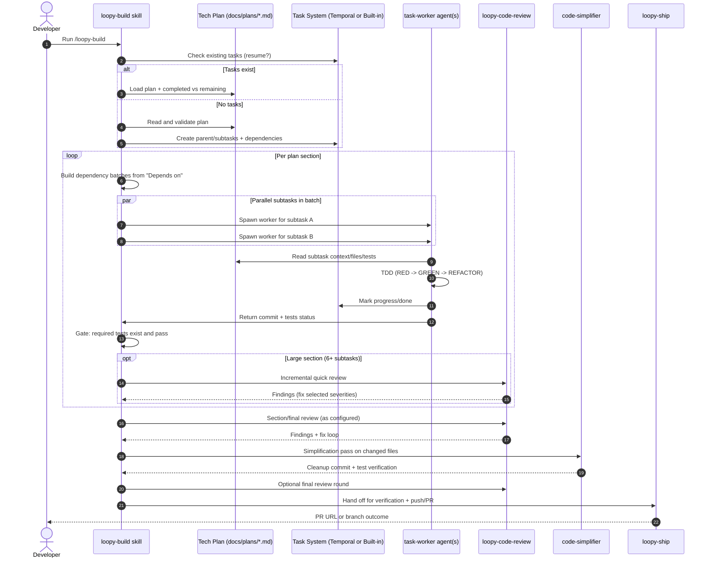

# Loopy Internals - Technical Plan

**Date:** 2026-02-27
**Status:** Draft
**PRD:** None

## Overview
Loopy is a workflow plugin that orchestrates requirements discovery, planning, implementation, review, and pull request creation through reusable skills and specialized agents.

## Architecture
Core components:
- Skill layer (`skills/*`): Entry workflows (`loopy-requirements`, `loopy-plan`, `loopy-build`, `loopy-ship`) that drive phase-based execution.
- Agent layer (`agents/*`): Focused workers (for example `task-worker`, review agents, PR creator) used by skills for delegated execution.
- Orchestration runtime: The CLI host executes skill instructions, spawns agents, runs tools, and enforces transitions and safeguards.
- Artifact layer (`docs/*`): Persistent outputs (`docs/prd`, `docs/plans`, spikes, review artifacts) used as handoff contracts between phases.
- Integration layer (`scripts/install.sh`, `Makefile`, `gh`, `git`): Installs skills, runs verification, and performs branch and PR operations.

Control flow (simplified):
User -> `/loopy-*` command -> entry skill
-> optional requirements/research/spike/review loops
-> plan creation (structured subtasks + dependencies)
-> build orchestration (dependency batches)
-> task-worker execution (TDD, tests, commits)
-> code review + fixes
-> implementation wrap-up (verification, push, PR)

Data flow:
PRD -> Technical Plan -> Subtasks/Dependencies -> Code + Tests + Commits -> Pull Request

## /loopy-build Sequence (DevX Friendly)



DevX takeaway:
- You provide a plan once.
- `/loopy-build` executes dependency-aware batches with test gates.
- Reviews and fixes happen before wrap-up, then PR creation is the final step.

## /loopy-optimize Sequence

Autoloop is a parallel workflow path for iterative optimization. Instead of a plan-build cycle, it runs a measure-propose-evaluate loop against a measurable metric.

```
User -> /loopy-optimize
-> discover programs (.loopy/autoloop/programs/*.md)
-> establish baseline metric (iteration 0)
-> loop:
   -> autoloop-optimizer proposes a targeted change
   -> implement on isolated branch (via loopy-workspace)
   -> safety gate: verify only Target files modified
   -> run evaluation command, extract metric
   -> accept (draft PR via pr-creator-worker) or reject (discard branch)
   -> log iteration in experiment log (docs/autoloop/<program>/log.md)
   -> check stop conditions (target met, max iterations, consecutive failures)
-> summary + next steps
```

Data flow:
Program Definition -> Experiment History -> Optimizer Proposal -> Branch + Commit -> Evaluation -> Accept/Reject -> Draft PR
